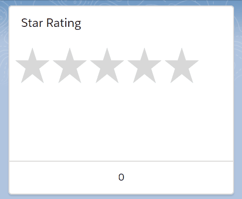

# lightning-star-rating

This is a custom Star Rating Salesforce Lightning Component. This component is based on [vue-star-rating](https://github.com/craigh411/vue-star-rating);

## Demo



## Implementation Notes

Note: `activeColor` only accepts a hex color *without* the leading `#` symbol.

## Sample Usage
```html
<aura:component description="TestComponent"
	access="global"
	implements="flexipage:availableForAllPageTypes" >

	<aura:attribute name="rating" type="Integer" default="2" />

	<lightning:card title="Star Rating">
		<c:StarRating rating="{!v.rating}"
      maxRating="5"
      activeColor="ffd055"
			readOnly="false" />
		<aura:set attribute="footer" >
			{!v.rating}
		</aura:set>
	</lightning:card>

</aura:component>
```
